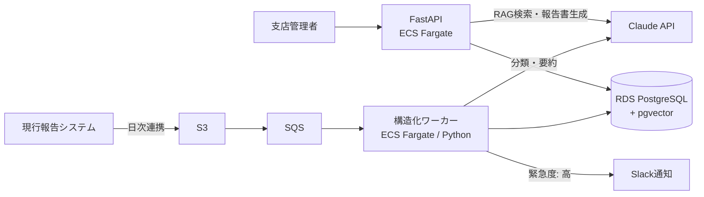

# Report Insight

現場報告書（写真＋自由記述テキスト）をLLMで構造化・要約し、過去事例を自然言語で横断検索できる社内システム。

> **本リポジトリはポートフォリオです。** クライアント・数値はすべて架空ですが、受託開発の実務プロセス（要件定義 → 基本設計 → ADR → 実装 → 評価 → 運用設計）を一人で通貫できることを示すため、実案件と同じ手順・品質で作成しています。

## 何を解決するか

中堅ビルメンテナンス会社（架空・従業員800名・管理物件1,200棟）では、1日約400件の現場報告書を管理者が目視確認しており、以下が課題になっている。

- 異常報告の見落とし・初動遅れ（確認が翌営業日になる）
- オーナー向け月次報告書の作成負荷（1物件2時間の手作業）
- 過去対応事例の属人化（ベテランの記憶頼み）

Report Insight は報告書を LLM で自動仕分けし、緊急案件を即時通知、月次報告書をドラフト生成、過去事例を RAG で検索可能にする。

## アーキテクチャ

## 技術スタック

| レイヤ | 技術 | 選定理由 |
|---|---|---|
| 言語/FW | Python 3.12 / FastAPI / SQLAlchemy | 型ヒント前提の非同期API |
| DB | PostgreSQL + pgvector | [ADR-001](docs/adr/ADR-001-vector-store.md) |
| コンピュート | ECS Fargate | [ADR-002](docs/adr/ADR-002-compute.md) |
| LLM | Claude API（タスク別にモデル使い分け） | [ADR-003](docs/adr/ADR-003-llm-strategy.md) |
| IaC | Terraform | 全リソースをコード管理 |
| CI/CD | GitHub Actions | test → LLM回帰評価 → build → deploy |
| 監視 | CloudWatch | 構造化失敗率・APIエラー率・トークン消費 |

## ドキュメント

受託案件の標準成果物として整備。

| ドキュメント | 内容 |
|---|---|
| [要件定義書](docs/01_requirements.md) | 背景・課題・機能/非機能要件・KPI・スコープ |
| [基本設計書](docs/02_basic_design.md) | システム構成・処理フロー・セキュリティ・監視・CI/CD |
| [API設計書](docs/03_api_design.md) | エンドポイント仕様・認証・エラー設計 |
| [DB設計書](docs/04_db_design.md) | ER図・DDL・ベクトル検索インデックス戦略 |
| [LLM設計書](docs/05_llm_design.md) | プロンプト設計・評価データセット・コスト試算・ハルシネーション対策 |
| [アーキテクチャ規約](docs/06_architecture.md) | 軽量クリーンアーキテクチャ・依存ルール・ポート設計 |
| [コーディング規約](docs/07_coding_standards.md) | ruff/mypy/import-linter による機械的強制・テスト/Git規約 |
| [開発環境セットアップ](docs/08_dev_setup.md) | Docker Compose（LocalStack含む）・Make ターゲット・環境変数 |
| [CI/CD・DevSecOps設計](docs/09_cicd_devsecops.md) | セキュリティゲート（SAST/SCA/IaC/イメージスキャン）・OIDC・デプロイ/ロールバック戦略 |
| [テスト計画書](docs/10_test_plan.md) | テストピラミッド・要件トレーサビリティ・非機能テスト・出口基準 |
| [ADR](docs/adr/) | 技術選定の意思決定記録 |

## このポートフォリオが証明すること

| 実務要件 | 本プロジェクトでの証明ポイント |
|---|---|
| バックエンド開発 | FastAPI + 非同期パイプライン + DB設計 |
| AWSインフラ構築・運用 | ECS / RDS / SQS / S3 を Terraform で構築、CloudWatch 監視 |
| 基本設計 | 要件定義書・基本設計書・ADR を docs/ として公開 |
| クライアントワーク | スコープ管理・「AIは下書きまで、確定は人間」等の業務判断 |
| LLM活用の難易度感 | ハルシネーション対策・評価データセット・コスト制御・モデル使い分け |

## セットアップ / 実行

（実装完了後に追記：ローカル起動手順・デモデータ投入・デプロイ手順）

## ステータス

- [x] 要件定義・基本設計・ADR
- [ ] 実装（取込パイプライン / RAG検索 / 月次生成 / 管理画面）
- [ ] LLM評価データセット・回帰評価
- [ ] Terraform / CI/CD
- [ ] デモ動画
