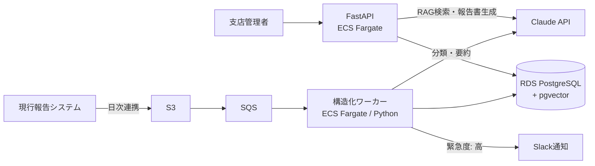

# Report Insight

現場報告書（写真＋自由記述テキスト）をLLMで構造化・要約し、過去事例を自然言語で横断検索できる社内システム。

> **本リポジトリはポートフォリオです。** クライアント・数値はすべて架空ですが、受託開発の実務プロセス（要件定義 → 基本設計 → ADR → 実装 → 評価 → 運用設計）を一人で通貫できることを示すため、実案件と同じ手順・品質で作成しています。

## 何を解決するか

中堅ビルメンテナンス会社（架空・従業員800名・管理物件1,200棟）では、1日約400件の現場報告書を管理者が目視確認しており、以下が課題になっている。

- 異常報告の見落とし・初動遅れ（確認が翌営業日になる）
- オーナー向け月次報告書の作成負荷（1物件2時間の手作業）
- 過去対応事例の属人化（ベテランの記憶頼み）

Report Insight は報告書を LLM で自動仕分けし、緊急案件を即時通知、月次報告書をドラフト生成、過去事例を RAG で検索可能にする。

## アーキテクチャ



## 技術スタック

| レイヤ | 技術 | 選定理由 |
|---|---|---|
| 言語/FW | Python 3.12 / FastAPI / SQLAlchemy | 型ヒント前提の非同期API |
| DB | PostgreSQL + pgvector | [ADR-001](docs/adr/ADR-001-vector-store.md) |
| コンピュート | ECS Fargate | [ADR-002](docs/adr/ADR-002-compute.md) |
| LLM | Claude API（タスク別にモデル使い分け） | [ADR-003](docs/adr/ADR-003-llm-strategy.md) |
| IaC | Terraform | 全リソースをコード管理 |
| CI/CD | GitHub Actions | test → LLM回帰評価 → build → deploy |
| 監視 | CloudWatch | 構造化失敗率・APIエラー率・トークン消費 |

## ドキュメント

受託案件の標準成果物として整備。

| ドキュメント | 内容 |
|---|---|
| [要件定義書](docs/01_requirements.md) | 背景・課題・機能/非機能要件・KPI・スコープ |
| [基本設計書](docs/02_basic_design.md) | システム構成・処理フロー・セキュリティ・監視・CI/CD |
| [API設計書](docs/03_api_design.md) | エンドポイント仕様・認証・エラー設計 |
| [DB設計書](docs/04_db_design.md) | ER図・DDL・ベクトル検索インデックス戦略 |
| [LLM設計書](docs/05_llm_design.md) | プロンプト設計・評価データセット・コスト試算・ハルシネーション対策 |
| [アーキテクチャ規約](docs/06_architecture.md) | 軽量クリーンアーキテクチャ・依存ルール・ポート設計 |
| [コーディング規約](docs/07_coding_standards.md) | ruff/mypy/import-linter による機械的強制・テスト/Git規約 |
| [開発環境セットアップ](docs/08_dev_setup.md) | Docker Compose（LocalStack含む）・Make ターゲット・環境変数 |
| [CI/CD・DevSecOps設計](docs/09_cicd_devsecops.md) | セキュリティゲート（SAST/SCA/IaC/イメージスキャン）・OIDC・デプロイ/ロールバック戦略 |
| [テスト計画書](docs/10_test_plan.md) | テストピラミッド・要件トレーサビリティ・非機能テスト・出口基準 |
| [IaC戦略](docs/11_iac_strategy.md) | Terraform構成・ステート管理・plan差分レビュー運用・ドリフト検知 |
| [ADR](docs/adr/) | 技術選定の意思決定記録 |

## このポートフォリオが証明すること

| 実務要件 | 本プロジェクトでの証明ポイント |
|---|---|
| バックエンド開発 | FastAPI + 非同期パイプライン + DB設計 |
| AWSインフラ構築・運用 | ECS / RDS / SQS / S3 を Terraform で構築、CloudWatch 監視 |
| 基本設計 | 要件定義書・基本設計書・ADR を docs/ として公開 |
| クライアントワーク | スコープ管理・「AIは下書きまで、確定は人間」等の業務判断 |
| LLM活用の難易度感 | ハルシネーション対策・評価データセット・コスト制御・モデル使い分け |

## セットアップ / 実行

ローカルは Docker Compose で完結する（AWS 実環境なしでフル機能をデモ可能。[開発環境 08](docs/08_dev_setup.md)）。

```bash
uv sync --all-extras         # 依存インストール（Python 3.12 は uv が取得）
cp env.example .env          # 既定は LLM_PROVIDER=fake（APIキー不要で全フロー動作）
make up                      # db(pgvector) / localstack / api / worker / webhook-mock を起動
make migrate                 # Alembic マイグレーション適用
make demo                    # 合成報告書100件を S3(LocalStack)投入 → SQS → worker 構造化 → DB 保存
open http://localhost:8000/healthz
```

> **env ファイル名について:** 設計文書 08 は `.env.example` を指すが、本実装環境の保護ガードによりドット無しの
> `env.example` で提供している（`cp env.example .env`）。中身・用途は同一。

テスト・静的検査:

```bash
make test              # unit（Fakeポートのみ・外部I/Oゼロ・高速）
make test-integration  # integration（testcontainers で pgvector 起動・実DB）
make lint              # ruff + mypy(strict) + import-linter（レイヤ依存の機械検査）
```

`ANTHROPIC_API_KEY` を設定し `LLM_PROVIDER=anthropic` にすると実 LLM・fastembed(e5-large) に切り替わる
（既定の fake では埋め込みも決定的なスタブを使い、完全オフラインで動作）。

## ステータス

- [x] 要件定義・基本設計・ADR
- [x] **P0: 足場**（pyproject/uv・Docker Compose・Alembic 全テーブル・core/domain/services・CI骨格）
- [x] **P0: F-1 取込パイプライン**（PIIマスキング → 分類(structured output) → confidence閾値 → needs_review → 緊急度高 Webhook通知 → 冪等UPSERT）
- [x] **P0: F-2 RAG検索**（埋め込み → ハイブリッド検索(認可フィルタ込み) → SSE(sources→token→done) → 引用実在検証 → 0件ショートサーキット）
- [x] **P1: F-3 月次報告書**（件数サマリをSQLで確定計算→LLMは文章化のみ→承認状態機械→WeasyPrint PDF。生成は202→ポーリング）
- [x] **P1: F-4 管理画面 + 権限**（一覧/フィルタ/未分類キュー/分類確定・Jinja2+HTMX・監査ログ・他支店403）
- [x] **P1: LLM評価ハーネス実装**（分類100/検索30/忠実性20・`make eval`）— 実API実測は下記「LLM評価」参照
- [x] **P1: Terraform**（modules 5種 + envs/dev,prod・validate/fmt green。詳細は `terraform/README.md`）
- [x] **P1: CI セキュリティゲート仕上げ**（gitleaks→bandit→pip-audit→integration→prompts変更時LLM回帰／
  terraform変更時 IaCスキャン→main で Docker build→Trivy(image)→SBOM。Alembic 可逆性検証込み）
- [x] **P1: 運用 Runbook**（`docs/runbook.md`: DLQ再処理・LLM縮退ラダー・構造化失敗率対応 ほか）
- [ ] P2: AWS dev への apply・OIDC デプロイジョブ・デモ動画

### LLM評価（`make eval`）

評価ハーネスは `tests/llm_eval/`（データセット3種 + 純粋な評価ロジック + オーケストレータ）。
受け入れ基準（LLM設計書 §4）: 分類accuracy≥90% / 緊急度high recall≥95% / recall@8≥85% /
忠実性≥4.0 / 引用実在率100%。プロンプトインジェクション検体で分類が汚染されないことも検証する。

- 実測（実LLM）は API キー必須・コスト有（約¥300）。手順:
  `.env` で `LLM_PROVIDER=anthropic` + `ANTHROPIC_API_KEY` を設定 → `make up && make migrate` →
  `make eval`。結果は `tests/llm_eval/last_result.json`（gitignore）に出力され、終了コードで合否。
  （ホストに 5432 を使うネイティブ PostgreSQL がある場合は compose の db 公開ポートを避け、
  `DATABASE_URL=...@localhost:5433/...` のように上書きして実行する。）
- **実API実測ステータス: PASS（2026-07-18 / claude-haiku-4-5）** —
  分類 accuracy 0.94・緊急度 high recall 1.00・検索 recall@8 1.00・引用実在率 1.00・
  忠実性（LLM-as-judge）mean 5.00・injection 耐性 OK。全指標が受け入れ基準を満たし総合 PASS。
- fake provider でのスモーク: ハーネスは端から端まで動作し injection 耐性チェックも機能
  （fake はキーワード分類のため精度閾値は満たさない＝閾値は実モデル向け）。

### テスト状況（P1 時点）

- unit 29件 / integration 21件 green（`make test` / `make test-integration`）
- `make lint`（ruff + mypy strict + import-linter 3契約）green
