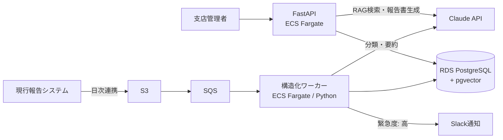

# 要件定義書 — 現場報告書AI処理・ナレッジ検索システム「Report Insight」

| 項目 | 内容 |
|---|---|
| 文書バージョン | 1.0 |
| 作成日 | 2026-07-17 |
| ステータス | 承認済（架空クライアント想定） |

> 本書はポートフォリオ用の架空案件です。クライアント・数値はフィクションですが、実際の受託案件で作成する要件定義書と同じ構成・粒度で記述しています。

---

## 1. エグゼクティブサマリー

- **一言で言うと**：ビルメンテナンス会社の現場報告書（写真＋自由記述テキスト）をLLMで構造化・要約し、過去事例を自然言語で横断検索できる社内システム
- **なぜ今か**：報告書の確認・オーナー向け月次報告の作成が管理部門の残業の主因になっており、属人化した過去事例の知見が退職とともに失われている
- **期待成果**：報告書処理時間を1件あたり15分→3分、月次報告書作成を1物件2時間→30分に短縮

## 2. クライアントと背景・課題

**クライアント設定（架空）**：中堅ビルメンテナンス会社。従業員約800名、管理物件約1,200棟、本社＋全国8支店。現場スタッフが日々の巡回・清掃・点検の報告書をスマホから提出している。

| 現状の課題 | 詳細 |
|---|---|
| 報告書の確認負荷 | 1日約400件の報告書を支店管理者が目視確認。異常報告の見落としリスクあり |
| 月次報告の作成負荷 | オーナー向け月次報告書を管理者が手作業で集計・執筆 |
| ナレッジの属人化 | 「あの物件の雨漏り、前どう対応したっけ」がベテランの記憶頼み |
| 表記ゆれ | 現場スタッフの自由記述のため、同じ事象でも書き方がバラバラで集計不能 |

## 3. 目的・ゴール（KPI）

| 指標 | 現状 | 目標 |
|---|---|---|
| 報告書1件の確認時間 | 15分 | 3分（AI一次仕分け＋管理者は要対応のみ確認） |
| 異常報告の初動までの時間 | 平均翌営業日 | 当日中（自動タグ付け＋通知） |
| 月次報告書の作成時間 | 2時間/物件 | 30分/物件（ドラフト自動生成） |
| 過去事例の検索 | 実質不可能 | 自然言語で10秒以内に候補提示 |

## 4. 利用者

| 利用者 | 人数 | 用途 | 備考 |
|---|---|---|---|
| 支店管理者（主利用者） | 各支店3〜5名 | 報告書の確認・承認、月次報告書作成 | ITリテラシー中程度 |
| 本社品質管理部 | 5名 | 全社横断の事例検索・傾向分析 | |
| 現場スタッフ（間接） | 約600名 | 既存の報告フローは変更しない | 現行システムからデータ連携 |

## 5. 機能要件

### F-1. 報告書の自動構造化（コア機能）

| ID | 要件 | 優先度 |
|---|---|---|
| F-1-1 | 現行システムからS3経由で報告書データ（テキスト＋写真メタ情報）を日次で取り込む | Must |
| F-1-2 | LLMで **事象分類**（清掃/設備異常/クレーム/その他）、**緊急度**（高/中/低）、**対応要否** を付与する | Must |
| F-1-3 | 場所・事象・状態を正規化した **構造化サマリ** を生成する（表記ゆれの吸収） | Must |
| F-1-4 | 緊急度「高」の報告書は Slack/メールへ即時通知する | Must |
| F-1-5 | LLMの確信度が低い場合は「未分類」に倒し、人間の確認キューへ回す | Must |

### F-2. ナレッジ検索（RAG）

| ID | 要件 | 優先度 |
|---|---|---|
| F-2-1 | 「〇〇ビルで過去に雨漏り対応した事例」のような自然言語検索ができる | Must |
| F-2-2 | ベクトル意味検索＋メタデータ（物件・日付・分類）フィルタのハイブリッド検索 | Must |
| F-2-3 | 回答には必ず根拠となる元報告書へのリンクを付与する（ハルシネーション対策） | Must |
| F-2-4 | 回答はストリーミング表示する | Should |

### F-3. 月次報告書ドラフト生成

| ID | 要件 | 優先度 |
|---|---|---|
| F-3-1 | 物件×月を指定すると、当月の報告書群からオーナー向け報告書ドラフト（Markdown）を生成する | Must |
| F-3-2 | 管理者が編集・承認してから確定する（**AIは下書きまで、確定は必ず人間**） | Must |
| F-3-3 | 確定した報告書はPDF出力できる | Should |

### F-4. 管理画面

| ID | 要件 | 優先度 |
|---|---|---|
| F-4-1 | 報告書一覧（AI付与タグでのフィルタ/ソート） | Must |
| F-4-2 | 自然言語検索UI | Must |
| F-4-3 | 月次報告書の編集・承認フロー | Must |
| F-4-4 | 未分類キュー（人間確認待ち）の表示 | Should |

### スコープ外（Phase 2 提案候補として明記）

- 現場スタッフ向け報告アプリの改修
- 会計・請求システム連携
- 多言語対応
- 写真画像からの劣化診断（画像解析）

## 6. 非機能要件

| 項目 | 要件 |
|---|---|
| 性能 | 検索応答3秒以内（LLM生成部はストリーミング表示）。報告書構造化は非同期で10分以内 |
| 可用性 | 業務時間内99%。夜間バッチ許容（社内システムのため過剰設計しない） |
| セキュリティ | 社外秘情報のため、LLM APIへ送信前に個人名・電話番号をマスキング。IP制限＋SSO想定 |
| コスト | LLM APIコスト月10万円以内。トークン量の実測とモデル使い分けで制御 |
| LLM品質 | 分類精度90%以上。評価データセット（100件）を作成し、プロンプト変更時に自動回帰評価 |
| 監視 | 構造化失敗率・APIエラー率・トークン消費を CloudWatch ダッシュボード化 |
| 保守性 | 全インフラを Terraform で IaC 化。CI/CD による自動デプロイ |

## 7. システム構成（概要）

詳細は[基本設計書](02_basic_design.md)を参照。

## 8. スケジュール

### 8.1 従来型見積り（人力開発を想定した参考値）

| フェーズ | 期間 | 内容 |
|---|---|---|
| 要件定義・基本設計 | 1週目 | 本書＋基本設計書・ADR・API設計 |
| MVP実装① | 2週目 | 取込パイプライン＋構造化（F-1）＋Terraform |
| MVP実装② | 3週目 | RAG検索（F-2）＋管理画面最小 |
| 仕上げ | 4週目 | 月次生成（F-3）＋評価データセット＋監視＋引き渡しドキュメント |

### 8.2 実際の進め方：AI駆動開発

本プロジェクトは AI 駆動開発（設計をドキュメントに固定 → AIエージェントが実装 → 人間が完了条件で検証）で進めるため、**実装フェーズは1日に圧縮する**（実行計画: [docs/plan/report-insight-1day_plan.md](plan/report-insight-1day_plan.md)）。

圧縮できる工程とできない工程を区別している点が重要：

| 工程 | AI駆動での扱い |
|---|---|
| 実装・テストコード・IaC | 大幅圧縮可（4週→1日）。ただし設計文書と完了条件の事前固定が前提 |
| 要件定義・設計判断（ADR） | 圧縮しない。ここが崩れると実装速度は無意味になる |
| LLM品質評価・受入確認 | 圧縮しない。評価データセットによる合否判定と人間の承認は人間律速 |

従来型見積り（8.1）は受託案件として提示する場合の参考値として残す。AI駆動の実績値との差分自体が、クライアントへの提案材料（開発費・納期の圧縮根拠）になる。

## 9. リスクと対策

| リスク | 対策 |
|---|---|
| LLMの分類ミス・ハルシネーション | 確信度が低い場合「未分類」に倒して人間確認へ。検索回答は原文リンク必須 |
| APIコスト超過 | タスク別モデル使い分け＋日次コストアラート |
| 表記ゆれで検索精度が出ない | 構造化時に正規化語彙へマッピング。評価セットで定量測定 |
| スコープ肥大 | スコープ外を本書に明記し、Phase 2 として提案する体裁に |

## 10. 成功指標

- 3章のKPIを導入後3ヶ月で達成すること
- 支店管理者へのヒアリングで「確認業務が楽になった」と回答が過半数
- LLM分類精度が評価データセットで90%以上を維持
