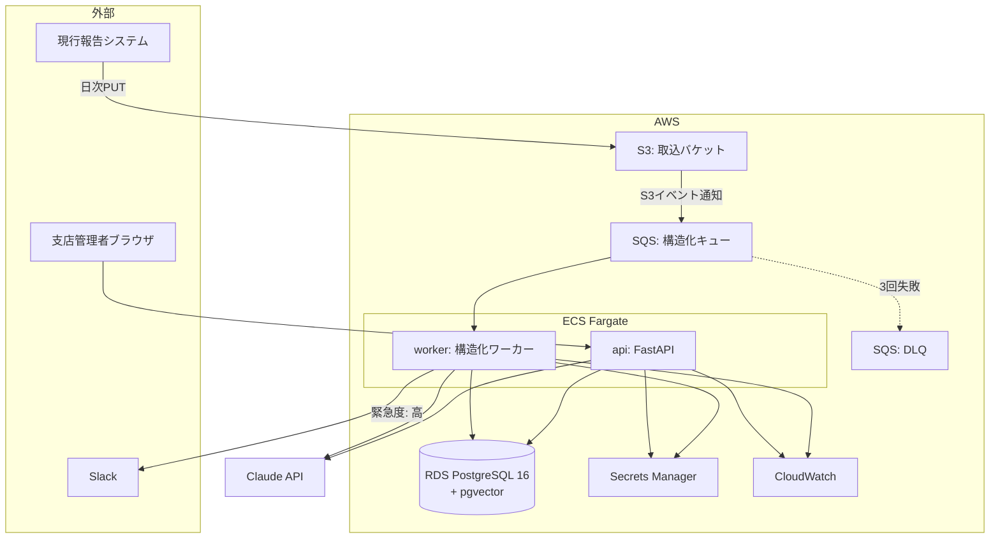
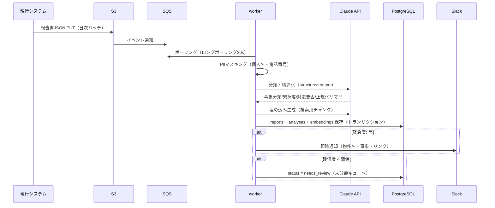
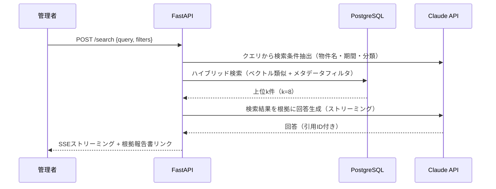
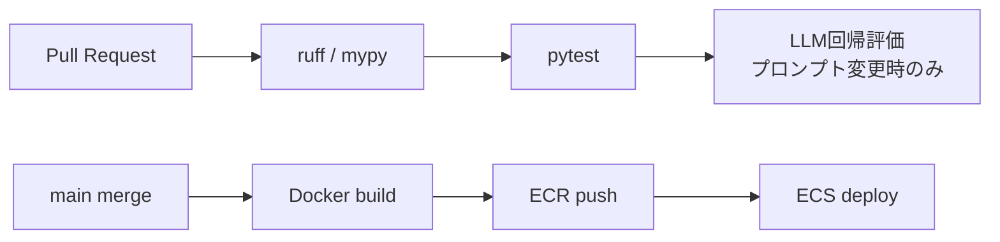

# 基本設計書 — Report Insight

| 項目 | 内容 |
|---|---|
| 文書バージョン | 1.0 |
| 作成日 | 2026-07-17 |
| 関連文書 | [要件定義書](01_requirements.md) / [API設計書](03_api_design.md) / [DB設計書](04_db_design.md) / [LLM設計書](05_llm_design.md) |

---

## 1. システム全体構成



### コンポーネント一覧

| コンポーネント | 役割 | 技術 |
|---|---|---|
| api | 管理画面向けREST API・RAG検索・月次報告書生成 | FastAPI / uvicorn |
| worker | S3→SQS経由の報告書取込・LLM構造化・通知 | Python（SQSポーリング） |
| frontend | 管理画面（報告書一覧・検索・承認） | FastAPI + Jinja2 + HTMX（最小構成） |
| db | 報告書・構造化結果・埋め込みベクトル・月次報告書 | PostgreSQL 16 + pgvector |
| infra | 上記全リソースのIaC | Terraform |

フロントエンドを SPA にしない理由：利用者は社内管理者のみで画面数が少なく、SSR + HTMX で十分。バックエンドのポートフォリオとして焦点をAPI・パイプライン設計に置く。

## 2. 処理フロー設計

### 2.1 報告書取込・構造化（非同期パイプライン）



**設計ポイント**

- **冪等性**：S3オブジェクトキーを一意キーとし、再配信されても二重登録しない（UPSERT）
- **リトライ**：SQS可視性タイムアウト5分、最大3回。超過は DLQ へ隔離し CloudWatch アラーム発報
- **バックプレッシャ**：LLM API のレートリミットに合わせ worker の同時実行数を制御（セマフォ）
- **部分失敗**：構造化成功・埋め込み失敗のような部分失敗は status 管理で再処理可能にする

### 2.2 RAG検索



- 回答プロンプトで「検索結果に無い情報は『該当事例なし』と答える」ことを強制
- 引用は `[report:123]` 形式で出力させ、API層で実在検証してからリンク化する

### 2.3 月次報告書生成

1. 管理者が物件×月を指定 → 当月の確定済み報告書を集計
2. 件数サマリ（分類別・緊急度別）はSQLで確定計算し、LLMには**文章化のみ**任せる（数字のハルシネーション防止）
3. 生成ドラフトは `draft` 状態で保存 → 管理者が編集 → `approved` で確定 → PDF出力

## 3. セキュリティ設計

| 項目 | 設計 |
|---|---|
| ネットワーク | ALB は社内IP制限（WAF IPセット）。RDS/worker はプライベートサブネット |
| 認証 | SSO（SAML）想定。ポートフォリオ実装ではセッション認証で代替し、境界を `AuthBackend` として抽象化 |
| 認可 | 支店管理者は自支店の物件のみ、品質管理部は全件（ロールベース） |
| PII保護 | LLM API 送信前に個人名・電話番号を正規表現＋形態素解析でマスキング（`[PERSON_1]` 形式、復元マップはDB内のみ） |
| シークレット | API キー・DB 認証情報は Secrets Manager。コード・環境変数に平文を置かない |
| 監査 | 検索クエリ・承認操作は audit_logs に記録 |

## 4. 監視・運用設計

| メトリクス | 閾値 | アクション |
|---|---|---|
| 構造化失敗率（5分間） | > 10% | CloudWatch Alarm → Slack |
| DLQ メッセージ数 | > 0 | 即時通知・手動再処理 Runbook |
| LLM API エラー率 | > 5% | フォールバックモデルへ切替（[ADR-003](adr/ADR-003-llm-strategy.md)） |
| 日次トークンコスト | > ¥5,000 | 通知（月次予算¥100,000の先行検知） |
| API p95 レイテンシ | > 3s | 調査トリガー |

ログは構造化JSON（structlog）で CloudWatch Logs へ。`request_id` / `report_id` で追跡可能にする。

## 5. インフラ構成（Terraform）

```
terraform/
├── envs/
│   ├── dev/          # 環境ごとの tfvars とバックエンド設定
│   └── prod/
└── modules/
    ├── network/      # VPC・サブネット・SG
    ├── ecs/          # クラスタ・サービス・タスク定義（api / worker）
    ├── rds/          # PostgreSQL + pgvector
    ├── pipeline/     # S3・SQS・DLQ・イベント通知
    └── observability/ # CloudWatch ダッシュボード・アラーム
```

- ステート管理：S3 バックエンド + DynamoDB ロック
- dev はコスト優先（RDS 単一AZ・Fargate Spot）、prod 構成は tfvars 差分のみで表現

## 6. CI/CD（GitHub Actions）



- LLM 回帰評価は `prompts/` 配下の変更を検知した時のみ実行（コスト制御）。詳細は[LLM設計書](05_llm_design.md)
- マイグレーションは Alembic。デプロイ前に自動適用

## 7. アプリケーション構成

```
app/
├── api/              # ルーター（reports / search / monthly_reports / auth）
├── core/             # 設定・DB接続・認証・ロギング
├── domain/           # エンティティ・ドメインロジック（LLM非依存）
├── services/         # ユースケース（構造化・検索・報告書生成）
├── llm/              # Claude クライアント・プロンプト・マスキング・評価
│   └── prompts/      # プロンプトはコードから分離しバージョン管理
├── worker/           # SQS コンシューマ
└── templates/        # Jinja2（管理画面）
tests/
├── unit/
├── integration/      # testcontainers で PostgreSQL 実物を使用
└── llm_eval/         # 評価データセット + 回帰評価ハーネス
```

依存方向：`api/worker → services → domain`。LLM 呼び出しは `llm/` に隔離し、テストではモック・評価では実APIを使い分ける。
