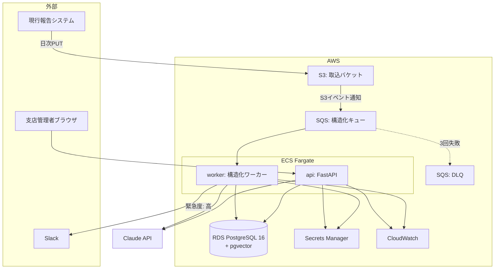
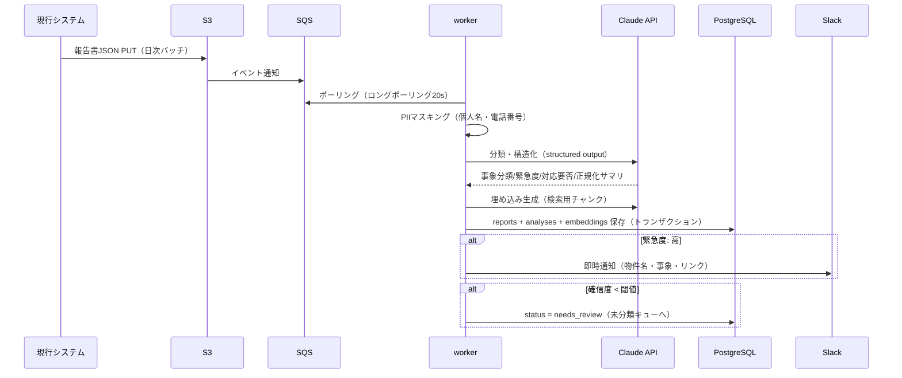
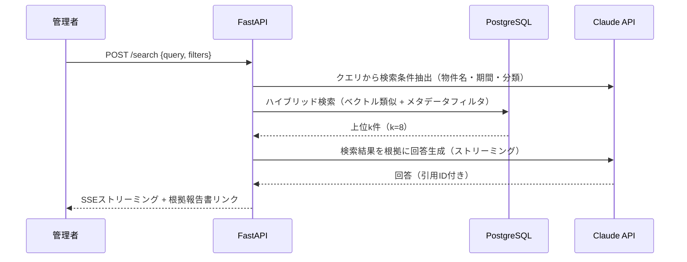
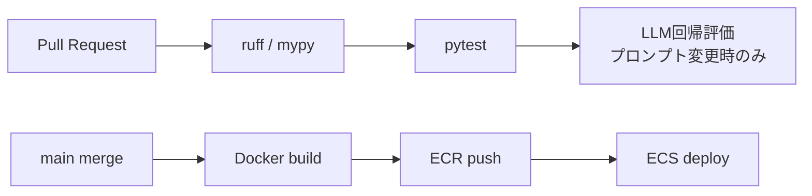
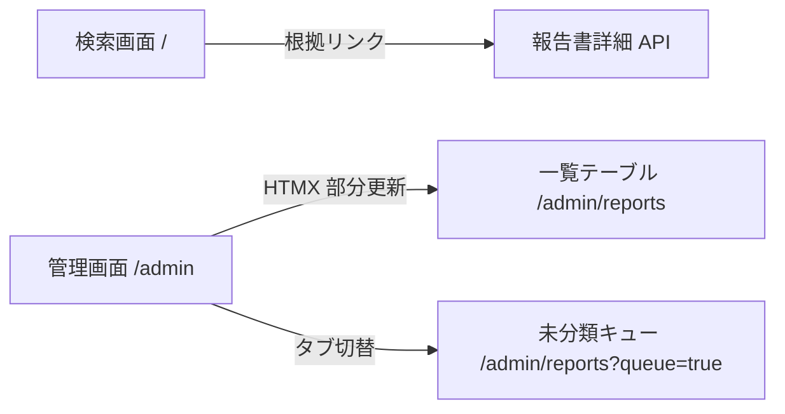

# 基本設計書 — Report Insight

| 項目 | 内容 |
|---|---|
| 文書バージョン | 1.1 |
| 作成日 | 2026-07-17 |
| 更新日 | 2026-07-18（要件IDの逆参照・画面設計 §8 を追記） |
| 関連文書 | [要件定義書](01_requirements.md) / [API設計書](03_api_design.md) / [DB設計書](04_db_design.md) / [LLM設計書](05_llm_design.md) |

各設計節の冒頭に **対応要件** として[要件定義書](01_requirements.md)の要件IDを逆参照し、全要件が設計でカバーされていることを追跡可能にしている。

---

## 1. システム全体構成



### コンポーネント一覧

| コンポーネント | 役割 | 技術 |
|---|---|---|
| api | 管理画面向けREST API・RAG検索・月次報告書生成 | FastAPI / uvicorn |
| worker | S3→SQS経由の報告書取込・LLM構造化・通知 | Python（SQSポーリング） |
| frontend | 管理画面（報告書一覧・検索・承認） | FastAPI + Jinja2 + HTMX（最小構成） |
| db | 報告書・構造化結果・埋め込みベクトル・月次報告書 | PostgreSQL 16 + pgvector |
| infra | 上記全リソースのIaC | Terraform |

フロントエンドを SPA にしない理由：利用者は社内管理者のみで画面数が少なく、SSR + HTMX で十分。バックエンドのポートフォリオとして焦点をAPI・パイプライン設計に置く。

## 2. 処理フロー設計

### 2.1 報告書取込・構造化（非同期パイプライン）

**対応要件**: F-1-1〜F-1-5



**設計ポイント**

- **冪等性**：S3オブジェクトキーを一意キーとし、再配信されても二重登録しない（UPSERT）
- **リトライ**：SQS可視性タイムアウト5分、最大3回。超過は DLQ へ隔離し CloudWatch アラーム発報
- **バックプレッシャ**：LLM API のレートリミットに合わせ worker の同時実行数を制御（セマフォ）
- **部分失敗**：構造化成功・埋め込み失敗のような部分失敗は status 管理で再処理可能にする

### 2.2 RAG検索

**対応要件**: F-2-1〜F-2-4



- 回答プロンプトで「検索結果に無い情報は『該当事例なし』と答える」ことを強制
- 引用は `[report:123]` 形式で出力させ、API層で実在検証してからリンク化する

### 2.3 月次報告書生成

**対応要件**: F-3-1〜F-3-3

1. 管理者が物件×月を指定 → 当月の確定済み報告書を集計
2. 件数サマリ（分類別・緊急度別）はSQLで確定計算し、LLMには**文章化のみ**任せる（数字のハルシネーション防止）
3. 生成ドラフトは `draft` 状態で保存 → 管理者が編集 → `approved` で確定 → PDF出力

## 3. セキュリティ設計

**対応要件**: 非機能要件「セキュリティ」（要件定義 §6）

| 項目 | 設計 |
|---|---|
| ネットワーク | ALB は社内IP制限（WAF IPセット）。RDS/worker はプライベートサブネット |
| 認証 | SSO（SAML）想定。ポートフォリオ実装ではセッション認証で代替し、境界を `AuthBackend` として抽象化 |
| 認可 | 支店管理者は自支店の物件のみ、品質管理部は全件（ロールベース） |
| PII保護 | LLM API 送信前に個人名・電話番号を正規表現＋形態素解析でマスキング（`[PERSON_1]` 形式、復元マップはDB内のみ） |
| シークレット | API キー・DB 認証情報は Secrets Manager。コード・環境変数に平文を置かない |
| 監査 | 検索クエリ・承認操作は audit_logs に記録 |

## 4. 監視・運用設計

**対応要件**: 非機能要件「監視」「コスト」（要件定義 §6）

| メトリクス | 閾値 | アクション |
|---|---|---|
| 構造化失敗率（5分間） | > 10% | CloudWatch Alarm → Slack |
| DLQ メッセージ数 | > 0 | 即時通知・手動再処理 Runbook |
| LLM API エラー率 | > 5% | フォールバックモデルへ切替（[ADR-003](adr/ADR-003-llm-strategy.md)） |
| 日次トークンコスト | > ¥5,000 | 通知（月次予算¥100,000の先行検知） |
| API p95 レイテンシ | > 3s | 調査トリガー |

ログは構造化JSON（structlog）で CloudWatch Logs へ。`request_id` / `report_id` で追跡可能にする。

## 5. インフラ構成（Terraform）

**対応要件**: 非機能要件「保守性」（要件定義 §6）

```
terraform/
├── envs/
│   ├── dev/          # 環境ごとの tfvars とバックエンド設定
│   └── prod/
└── modules/
    ├── network/      # VPC・サブネット・SG
    ├── ecs/          # クラスタ・サービス・タスク定義（api / worker）
    ├── rds/          # PostgreSQL + pgvector
    ├── pipeline/     # S3・SQS・DLQ・イベント通知
    └── observability/ # CloudWatch ダッシュボード・アラーム
```

- ステート管理：S3 バックエンド + DynamoDB ロック
- dev はコスト優先（RDS 単一AZ・Fargate Spot）、prod 構成は tfvars 差分のみで表現
- **ツール選定の根拠は[ADR-004](adr/ADR-004-iac-tool.md)、ステート管理・CI統合・ドリフト検知・ガードレールの詳細は[IaC戦略](11_iac_strategy.md)が正**

## 6. CI/CD（GitHub Actions）

**対応要件**: 非機能要件「保守性」「LLM品質」（要件定義 §6）



- LLM 回帰評価は `prompts/` 配下の変更を検知した時のみ実行（コスト制御）。詳細は[LLM設計書](05_llm_design.md)
- マイグレーションは Alembic。デプロイ前に自動適用
- **セキュリティゲート（gitleaks/SAST/SCA/IaC/イメージスキャン）・OIDC・ロールバック戦略を含むパイプラインの正式定義は[CI/CD・DevSecOps設計](09_cicd_devsecops.md)**。本節は概要のみ

## 7. アプリケーション構成

軽量クリーンアーキテクチャを採用する。依存方向は `api/worker → services → domain`、外部I/O（DB・LLM・AWS・通知）はポート（Protocol）の背後の `infra/` に隔離し、テストでは Fake・評価では実APIを使い分ける。

**ディレクトリ構造・依存ルール・ポート定義の詳細は[アーキテクチャ規約](06_architecture.md)が正**。コーディング規約は[07_coding_standards.md](07_coding_standards.md)、ローカル開発環境（Docker Compose）は[08_dev_setup.md](08_dev_setup.md) を参照。

```
tests/
├── unit/             # domain / services（Fakeポートのみ・外部I/Oゼロ）
├── integration/      # compose 上の実 PostgreSQL・LocalStack を使用
└── llm_eval/         # 評価データセット + 回帰評価ハーネス（実API）
```

## 8. 画面設計（F-4）

**対応要件**: F-4-1〜F-4-4

SSR + HTMX の最小構成方針（§1）に従い、画面は2枚に絞る。

### 8.1 画面一覧・遷移



| 画面 | パス | 主な項目 | アクション | 対応要件 |
|---|---|---|---|---|
| 検索画面 | `/` | 検索ボックス、回答（SSEストリーミング表示）、根拠報告書リンク | 自然言語検索の実行 | F-4-2（F-2 の画面提供） |
| 管理画面 | `/admin` | フィルタ（物件・事象分類・緊急度・ステータス）、報告書一覧テーブル、未分類キュータブ | 絞り込み、一覧/キューの切替、分類の上書き | F-4-1 / F-4-4 |

### 8.2 設計方針

- 一覧・キューの更新は HTMX でテーブル部分（`/admin/reports`）のみ差し替え、全画面リロードしない
- 認可はサービス層で強制（許可された物件IDのみ検索条件に載せる）。画面には権限内データしか渡らないため、テンプレート側に権限分岐を持たない（§3）
- LLM 由来テキスト（正規化サマリ・原文）はテンプレートの自動エスケープでサニタイズする（XSS 対策）
- 月次報告書の編集・承認（F-4-3）はドラフト保存・承認・PDF出力を API として提供し、専用画面は Phase 2 で追加する。「承認後は編集不可」「承認の監査記録」の保証は API 層に置き、画面の有無に依存させない
