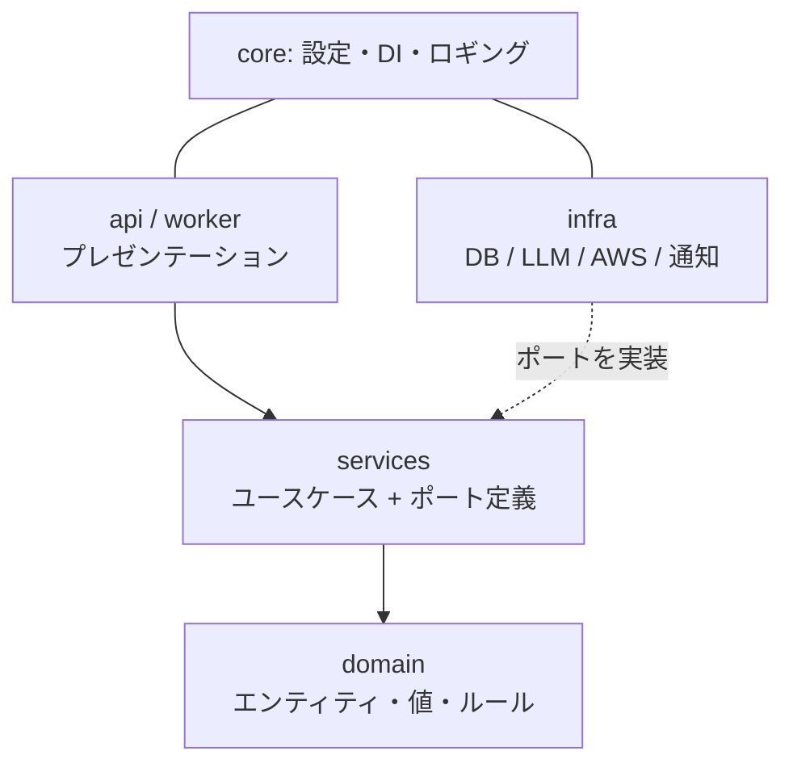

# アーキテクチャ規約 — Report Insight

| 項目 | 内容 |
|---|---|
| 文書バージョン | 1.0 |
| 位置づけ | **コード構造はこの文書が正**（[基本設計書 §7](02_basic_design.md#7-アプリケーション構成) の詳細化） |

---

## 1. 方針：軽量クリーンアーキテクチャ

フルDDDではなく、**「依存の向きだけは絶対に守る」軽量クリーンアーキテクチャ**を採用する。

- 守るもの：レイヤの依存方向・ポート（Protocol）による外部依存の隔離・domain の純粋性
- 割り切るもの：レイヤごとの厳格なDTO変換の強制・集約/リポジトリの教科書的な粒度

理由：本システムの複雑さの中心は「LLMという確率的コンポーネントの隔離とテスト容易性」にある。LLM・DB・AWSをポートの背後に置けばテストと差し替え（[ADR-003](adr/ADR-003-llm-strategy.md)のモデル切替、[ADR-001](adr/ADR-001-vector-store.md)の将来のOpenSearch移行）が成立する。それ以上の層は過剰。

## 2. レイヤと依存ルール



| ルール | 内容 |
|---|---|
| 依存は内向きのみ | `api/worker → services → domain`。逆向き import は禁止（CI の import-linter で機械検査） |
| domain は外部依存ゼロ | 標準ライブラリ＋pydantic のみ。SQLAlchemy・anthropic・boto3 を import したら違反 |
| services は実装を知らない | 外部I/Oはすべて `services/ports.py` の Protocol 経由。`infra/` の直接 import 禁止 |
| infra はポートの実装のみ | ビジネス判断（閾値・分岐）を infra に書かない |
| 組み立ては core/di.py のみ | ポート実装の選択（実LLM/Fake、AWS/LocalStack）は composition root に集約 |

## 3. ディレクトリ構造

```
app/
├── core/              # 設定(pydantic-settings)・DI(composition root)・ロギング(structlog)
├── domain/
│   ├── entities.py    # Report / ReportAnalysis / MonthlyReport
│   ├── values.py      # Category / Urgency / AnalysisStatus（Enum）・確信度閾値等の定数
│   └── errors.py      # ドメイン例外（NotFound / PermissionDenied / InvalidState）
├── services/
│   ├── ports.py       # LLMClient / EmbeddingClient / ReportRepository / SearchRepository /
│   │                  # NotificationPort / ObjectStoragePort / PIIMaskerPort（すべて Protocol）
│   ├── ingest.py      # 取込→マスキング→構造化→保存→通知（F-1）
│   ├── search.py      # ハイブリッド検索→回答生成→引用検証（F-2）
│   └── monthly.py     # 集計→文章化→承認フロー（F-3）
├── infra/
│   ├── db/            # SQLAlchemyモデル・リポジトリ実装・エンティティ⇔ORMマッパ・Alembic
│   ├── llm/           # AnthropicLLMClient / FakeLLMClient / prompts/（バージョン付きYAML）
│   ├── embedding/     # fastembed 実装
│   ├── aws/           # S3/SQS（エンドポイントを env で LocalStack に切替）
│   ├── masking/       # 正規表現＋形態素解析による PIIMasker 実装
│   └── notify/        # Slack Incoming Webhook
├── api/               # FastAPIルーター・pydanticスキーマ・Problem Details変換・templates/(HTMX)
└── worker/            # SQSコンシューマのエントリポイント（受信→ingest サービス呼び出しのみ）
```

## 4. 規約の要点

### ポート定義の例（services/ports.py）

```python
class LLMClient(Protocol):
    async def classify_report(self, masked_text: str) -> ClassificationResult: ...
    async def stream_answer(
        self, query: str, sources: Sequence[SearchHit]
    ) -> AsyncIterator[str]: ...
```

- 戻り値は **domain の型**（pydanticモデル/Enum）。プロバイダ固有のレスポンス型をポートから漏らさない
- `FakeLLMClient` は同じ Protocol を実装し、unit/integration テストで使用（実APIは評価ハーネスのみ）

### ORM とエンティティの分離

- SQLAlchemy モデルは `infra/db/models.py` に閉じ、リポジトリ実装がエンティティへマッピングして返す
- 理由：domain/services を DB 非依存に保ち、ユースケースのテストを Fake リポジトリだけで完結させるため

### トランザクション境界

- 1ユースケース = 1トランザクション。境界は services が持ち、リポジトリは同一セッションを共有する（Unit of Work を DI で注入）
- worker の「構造化成功・埋め込み失敗」等の部分失敗は status 更新で表現し、ロールバックで巻き戻さない（再処理可能性を優先。基本設計 §2.1）

### API 層の責務

- ルーターは「認証・入力検証・サービス呼び出し・Problem Details 変換」のみ。ビジネスロジックを書いたら違反
- ドメイン例外→HTTPステータスの対応表は 1 箇所（`api/error_handlers.py`）に集約

### 判断に迷ったら

- 「LLM/DB/AWSが絡む分岐」→ services、「データの整合性ルール」→ domain、「外部サービスの呼び方」→ infra
- 迷った判断は ADR に 5 行で残す（完璧な文書より記録の存在を優先）
