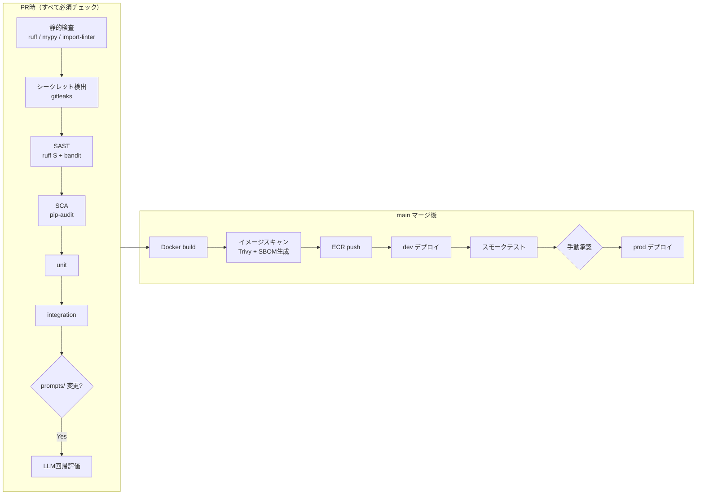

# CI/CD・DevSecOps設計 — Report Insight

| 項目 | 内容 |
|---|---|
| 文書バージョン | 1.0 |
| 方針 | **シフトレフト**：セキュリティ検査を人間の心がけではなくパイプラインのゲートとして機械化する |

---

## 1. パイプライン全体像

## 2. セキュリティゲート一覧（DevSecOps）

| ゲート | ツール | タイミング | 落ちる条件 |
|---|---|---|---|
| シークレット混入検出 | gitleaks | pre-commit ＋ CI | APIキー・認証情報のコミット検出 |
| SAST（静的アプリ検査） | ruff S ルール ＋ bandit | PR | SQLインジェクション疑い・弱い乱数・eval 等 |
| SCA（依存脆弱性） | pip-audit ＋ Renovate | PR ＋ 週次自動PR | Critical/High の既知CVE |
| IaC スキャン | Trivy (config) | PR（terraform/ 変更時） | SG全開放・暗号化なしRDS・公開S3 等 |
| コンテナスキャン | Trivy (image) | build 後 | ベースイメージの Critical CVE |
| SBOM | Syft | build 後 | 生成失敗（成果物としてリリースに添付） |
| 依存の固定 | uv.lock ＋ ベースイメージ digest 固定 | 常時 | - |

### 脆弱性トリアージ SLA（運用ルール）

| 深刻度 | 対応期限 |
|---|---|
| Critical | 24時間以内に修正 or 緩和策 |
| High | 7日以内 |
| Medium 以下 | 月次でまとめて判断（Renovate の自動PRベース） |

## 3. クレデンシャル設計（静的キーゼロ）

- **GitHub Actions → AWS は OIDC フェデレーション**。長期アクセスキーをリポジトリシークレットに置かない
- デプロイ用 IAM ロールは最小権限（ECR push・ECS UpdateService・対象タスク定義のみ）。Terraform apply 用ロールとは分離
- アプリ実行時のシークレットは Secrets Manager から ECS タスク定義経由で注入（[基本設計書 §3](02_basic_design.md#3-セキュリティ設計)）。CI には ANTHROPIC_API_KEY（評価用）のみを GitHub Environments のシークレットとして登録

## 4. ブランチ保護と環境

| 対象 | ルール |
|---|---|
| main | 直 push 禁止・PR 必須・§1 の全チェック required・force-push 禁止 |
| GitHub Environments | dev = main マージで自動デプロイ / prod = 手動承認必須（承認ログが監査証跡になる） |
| タグ | prod デプロイ時に `vX.Y.Z` を打つ（ロールバック先の特定用） |

## 5. デプロイ戦略とロールバック

- **ECS ローリングデプロイ＋デプロイサーキットブレーカー**：ヘルスチェック失敗時は自動で前タスク定義へロールバック
- スモークテスト：デプロイ後に `/readyz` と主要API 3本（一覧・検索・月次取得）を叩いて 200 を確認。失敗で自動ロールバック
- **DBマイグレーションは expand-contract（後方互換）を原則**とする：新旧タスクが混在するローリング中も動くよう、「カラム追加→デプロイ→旧カラム削除は次リリース」に分割。`alembic downgrade` は開発用であり本番ロールバック手段にしない
- LLM 起因の品質劣化（コード変更なし・モデル側変動）はデプロイロールバックでは直らないため、縮退ラダー（[LLM設計書 §5-6](05_llm_design.md)）で対応する

## 6. 監視との接続（DevSecOpsの「Ops」）

- デプロイイベントを CloudWatch にマーカー送信し、エラー率・レイテンシの変化とデプロイを突合できるようにする
- 監視項目・アラーム閾値は[基本設計書 §4](02_basic_design.md#4-監視運用設計)。DLQ 再処理・障害時縮退の手順は運用 Runbook（実装時に `docs/runbook.md` として作成）に記載
- 監査ログ（検索・承認・分類上書き）は audit_logs テーブルに1年保持（アプリ層）。CloudWatch Logs は90日保持

## 7. LLM固有のセキュリティ

プロンプトインジェクション対策・出力ハンドリング等は[LLM設計書 §7](05_llm_design.md#7-llmセキュリティ)に定義（OWASP LLM Top 10 ベース）。
