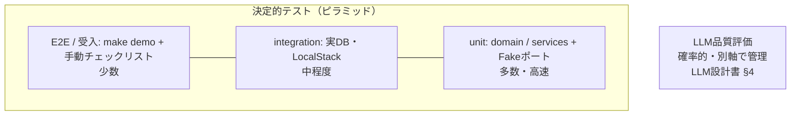

# テスト計画書 — Report Insight

| 項目 | 内容 |
|---|---|
| 文書バージョン | 1.0 |
| 位置づけ | 「何を・どのレベルで・どこまでやったら合格か」の計画。書き方の規約は[コーディング規約 §6](07_coding_standards.md#6-テスト規約) |

---

## 1. テスト戦略（ピラミッド＋LLM評価の別軸）

**原則：LLMの非決定性を決定的テストに混ぜない。** unit/integration/E2E は FakeLLMClient で常に同じ結果を返し、プロンプト品質は評価ハーネス（合格基準つき）だけが判定する。この分離が「たまに落ちるテスト」を構造的に排除する。

## 2. テストレベル定義

| レベル | 対象 | 環境 | 実行タイミング | 責務 |
|---|---|---|---|---|
| unit | domain / services | Fakeポートのみ・I/Oゼロ | 常時（pre-commit / PR） | ビジネスルール（閾値判定・状態遷移・権限） |
| integration | infra / API | compose の実 PostgreSQL・LocalStack | PR | SQL（ハイブリッド検索・UPSERT）・SQS配線・SSE・マイグレーション |
| E2E / 受入 | 全体フロー | compose 一式＋FakeLLM | リリース前 | `make demo` の投入→構造化→検索→月次承認の一気通貫 |
| LLM評価 | プロンプト品質 | 実API | prompts/ 変更時＋リリース前 | 分類精度・検索再現率・忠実性（[LLM設計書 §4](05_llm_design.md)） |
| 非機能 | 性能・回復性・セキュリティ | compose / dev環境 | リリース前 | §4 参照 |

## 3. 要件トレーサビリティ

| 要件 | 主な検証テスト（例） | レベル |
|---|---|---|
| F-1-2/3 構造化 | 分類accuracy・正規化の評価セット / 構造化結果の保存整合 | LLM評価 / integration |
| F-1-4 緊急通知 | 緊急度「高」でWebhookペイロード送信 | integration |
| F-1-5 確信度閾値 | confidence 0.84 → needs_review、0.85 → auto_classified（境界値） | unit |
| F-2-2 ハイブリッド検索 | ベクトル＋メタデータフィルタのSQL結果 / 認可フィルタ混入なし | integration |
| F-2-3 引用検証 | 実在しない引用IDの除去・幻覚率メトリクス記録 | unit＋integration |
| F-3-2 承認フロー | draft→approved 遷移 / approved 後の編集 422 / 権限外承認 403 | unit＋integration |
| F-4 管理画面 | 受入チェックリスト（§5）で手動確認 | E2E |
| 冪等性（基本設計 §2.1） | 同一 source_key の二重配信で重複登録なし | integration |
| 権限マトリクス（API設計 §4） | 他支店データへのアクセス403・検索結果非混入 | integration |

実装時、各テストの docstring に要件ID（`F-1-5` 等）を記載し、grep で網羅を確認できるようにする。

## 4. 非機能テスト

| 種別 | 内容 | 合格基準 |
|---|---|---|
| 性能（スモーク） | Locust で検索API 10並行×5分（FakeLLM。LLM部を除いた検索基盤の性能を測る） | p95 < 1s（LLM除く。全体3秒以内の予算配分） |
| 回復性 | ①FakeLLM に一時障害を注入→SQS再配信で最終的に処理完了 ②パース不能データ→3回で DLQ 隔離 | データロスゼロ・DLQ隔離が観測できる |
| セキュリティ | 認可テスト（§3）＋ 依存/イメージ/IaCスキャン（[CI/CD・DevSecOps設計 §2](09_cicd_devsecops.md)）＋ プロンプトインジェクション評価（[LLM設計書 §7](05_llm_design.md#7-llmセキュリティ)） | ゲート全通過・注入評価セット合格 |
| マイグレーション | upgrade → downgrade → upgrade の往復（CI） | エラーなし |

## 5. 受入チェックリスト（リリース前・手動）

- [ ] 管理画面：一覧のフィルタ/ソート、未分類キュー、検索UI（根拠リンクから元報告書へ遷移できる）
- [ ] 月次報告書：生成→編集→承認→PDF ダウンロード
- [ ] 検索0件時に「該当事例なし」が表示され、それらしい捏造回答が出ない
- [ ] 支店管理者アカウントで他支店の物件が一切見えない
- [ ] デプロイ後スモーク（/readyz＋主要API 3本）が通る（dev環境がある場合）

## 6. カバレッジ・出口基準

| 項目 | 基準 |
|---|---|
| ラインカバレッジ | domain＋services 90%以上 / 全体 80%以上（CI で閾値強制） |
| flaky テスト | 許容ゼロ。発生したら即 quarantine マークし、修正 issue を切る（放置禁止） |
| リリース可否 | ①全自動テスト green ②LLM評価が合格基準クリア ③受入チェックリスト完了 ④セキュリティゲート全通過 |

カバレッジは目安であり、**§3 のトレーサビリティ（要件がテストで覆われていること）を優先する**。数字合わせのためのテストは書かない。

## 7. テストデータ管理

- テスト・評価・デモのデータはすべて合成ジェネレータ（`scripts/generate_demo_data.py`）から生成し、**実在の個人名・物件名・実データは一切使わない**
- 評価セットは境界例・悪文・表記ゆれ・プロンプトインジェクション文字列を意図的に含める（生成ロジックにカテゴリとして組み込み、分布を README に記録）
- 運用開始後の実データ還流（人間修正履歴→評価セット）はマスキング済みテキストのみを対象とする
