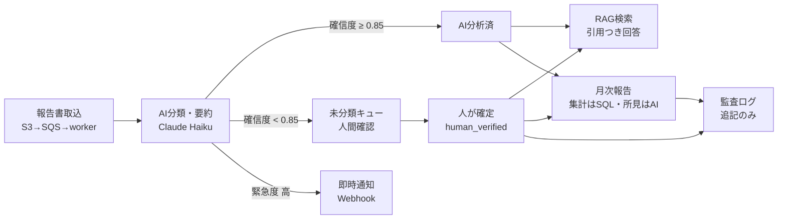
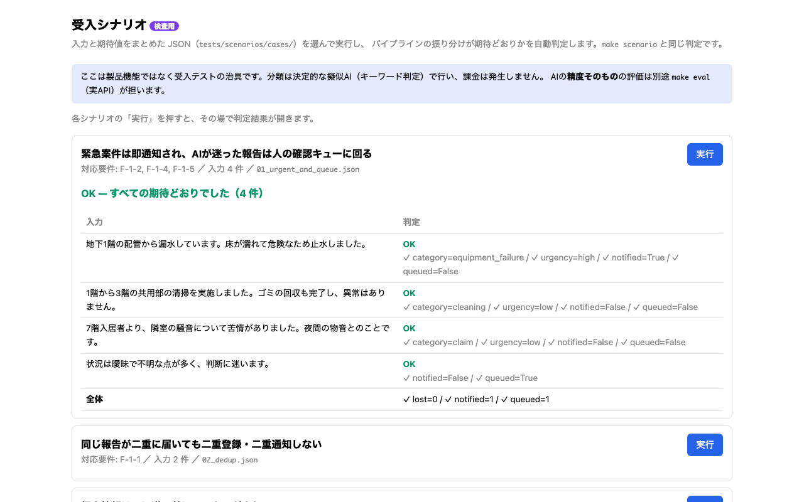
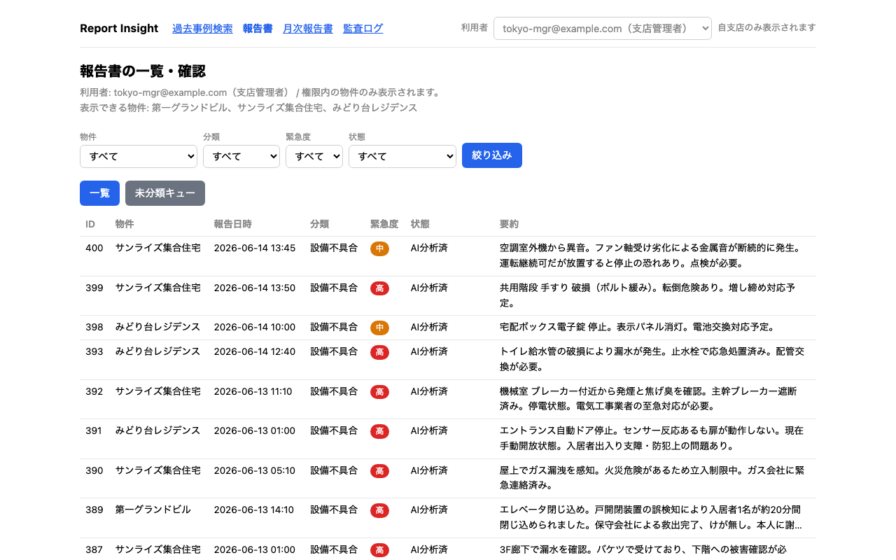
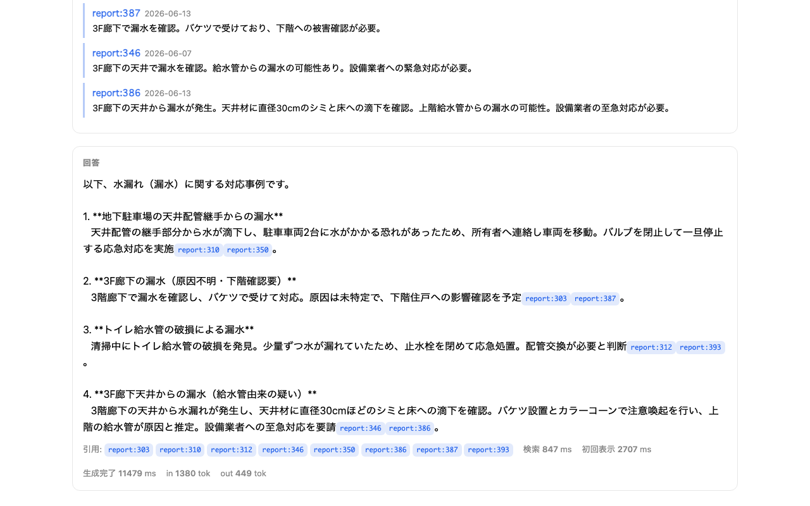
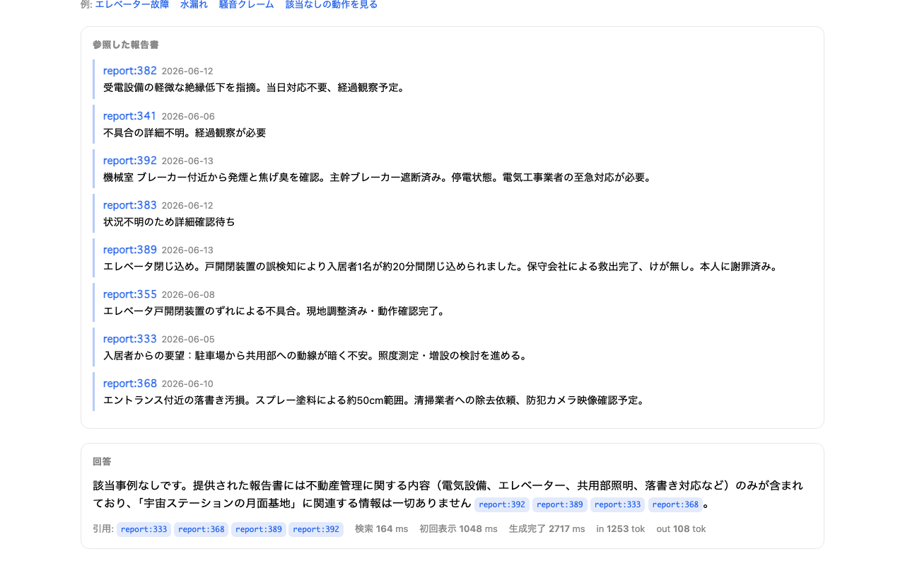

# 操作フロー: 取込 → AI分類 → 人間確認 → RAG検索 → 月次報告

現場の報告書が届いてからオーナー向け月次報告書になるまでの流れと、各段階の担当画面。

## 1. 報告書取込（画面なし・意図的）

- **経路**: S3 到着イベント → SQS → ワーカー（`app/worker/main.py` → `app/services/ingest.py`）
- 現場スタッフは既存の報告システムを使い続ける前提のため、投入用の画面は**要件どおりスコープ外**。デモでは `make demo` が合成報告書100件を S3(LocalStack) に投入する
- 取込時に PII マスキング（AIに送る前に個人情報を伏せる）と表記ゆれ正規化を通す
- 同じ報告書が二重に届いても二重登録・二重通知しない（冪等）
- パイプラインの振る舞いは `/scenarios`（受入シナリオの自動判定）で確認できる

## 2. AI分類（自動）

- Claude が分類（清掃/設備不具合/苦情・要望/その他）・緊急度・要約・確信度を返す（structured output）
- **緊急度「高」は即時に Webhook 通知**（デモでは http://localhost:9000/received で受信JSONを確認）
- **確信度 0.85 未満は自動確定せず「未分類（要確認）」として人間のキューへ**

## 3. 人間確認（`/admin` 未分類キュー）

- AIが迷った報告書だけが並ぶ。行をクリックすると原文・AIの提案（分類/緊急度/確信度）が出る
- 人が「この内容で確定する」を押すと `human_verified` になりキューから消え、**監査ログに記録**される
- 確定結果は評価データセットへ還流できる（`scripts/export_corrections.py`）— 使うほど賢くなるループ

## 4. RAG検索（`/search`）

- 自然な言葉で聞くと、権限内の報告書をハイブリッド検索し、回答が SSE でストリーミング表示される
- 回答内の `report:番号` は**実在検証済みの引用**（存在しない報告書番号は引用として通さない）
- 該当する報告書が無ければ**生成せず「該当なし」**（0件ショートサーキット。推測で答えない）
- 画面下部に検索ms・初回表示ms（非機能要件3秒の実測）・トークン数を常時表示

## 5. 月次報告（`/monthly`）

- 「ドラフトを作る」→ **件数はデータベースの集計値**、AIが書くのは所見の文章だけ（数値ハルシネーション対策）
- 2ペインエディタで人が編集 → 「承認して確定する」→ **承認後は編集不可**、PDF ダウンロード
- 品質管理部（QA）ロールは閲覧のみで、作成・承認はできない

## 6. 監査（`/audit`）

- 分類の上書き・月次の承認・検索の実行が**追記のみ**のログに残る（書き換え・削除不可）

## 権限（全画面共通）

- 支店管理者は自支店の物件のみ、品質管理部は全社横断（閲覧のみ）。**認可はサービス層で強制**され、画面・検索・月次すべてが権限の範囲に閉じる
- デモの利用者切替はヘッダのセレクタ（SSO の抽象点。本番はセッションに置換）

対応する要件IDと受入手順の詳細は [../12_uat_cases.md](../12_uat_cases.md)（29ケース）を参照。
